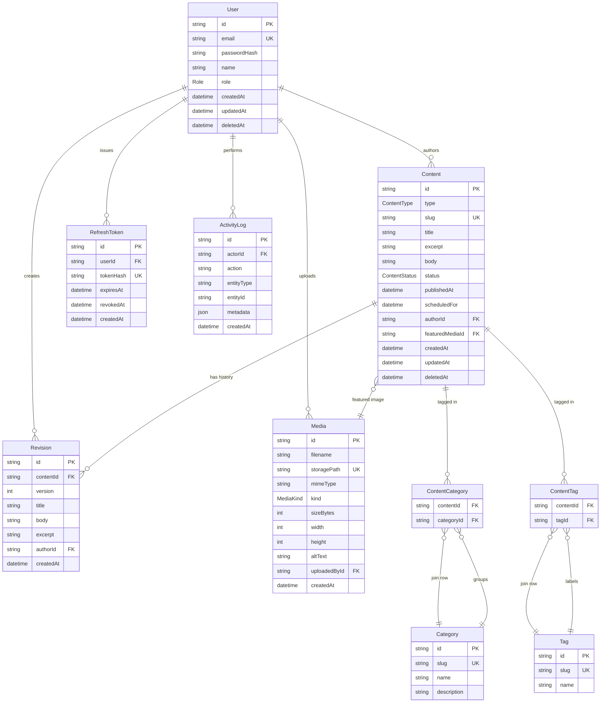

# Database Schema & Data Models — Multi-Author CMS

## 1. Entity Relationship Design

### Decision: Post vs Page — **Single `Content` table with `type` discriminator**

**Rationale**: Posts and Pages share ~90% of their fields (title, slug, body, status, author, revisions, soft delete, scheduled publish, SEO metadata). The differences are:
- Posts have categories/tags and appear in feeds/timelines.
- Pages are standalone static content (About, Contact) without taxonomy.

A single `Content` table with `type: ContentType` (POST | PAGE) gives us:
- One revision system, one publishing pipeline, one search index, one repository.
- Categories/tags relate only to `Content` rows where `type = POST` (enforced at the service layer; foreign keys still reference `Content.id`).
- Avoids duplicating the lifecycle state machine and scheduled-publish logic across two tables.

Trade-off accepted: a few nullable taxonomy joins for PAGE rows, in exchange for dramatically less code and a single source of truth for content lifecycle.

### Decision: User soft delete

Users are **soft-deleted** (`deletedAt`). Hard delete would orphan authored content's `authorId` FK or force cascading deletion of posts. Soft delete preserves authorship attribution and audit trails. Admin can hard-purge via a separate explicit operation if ever needed (out of scope for MVP).

### ER Diagram



### Cardinality summary

| Relationship | Cardinality | Ownership / Notes |
|---|---|---|
| User → Content | 1:N | `Content.authorId` (required) |
| User → RefreshToken | 1:N | Cascade delete on hard user purge |
| User → Revision | 1:N | `Revision.authorId` records who saved that revision |
| User → Media | 1:N | `Media.uploadedById` (required) |
| User → ActivityLog | 1:N | `ActivityLog.actorId` (required) |
| Content → Revision | 1:N | Cascade: deleting Content removes Revisions |
| Content ↔ Category | M:N | via `ContentCategory` join |
| Content ↔ Tag | M:N | via `ContentTag` join |
| Content → Media (featured) | N:1 | `Content.featuredMediaId` (optional) |

---

## 2. Prisma Schema

```prisma
// schema.prisma

generator client {
  provider = "prisma-client-js"
}

datasource db {
  provider = "postgresql"
  url      = env("DATABASE_URL")
}

// ───────────────────────── Enums ─────────────────────────

enum Role {
  ADMIN
  EDITOR
  AUTHOR
}

enum ContentType {
  POST
  PAGE
}

enum ContentStatus {
  DRAFT
  IN_REVIEW
  PUBLISHED
  ARCHIVED
}

enum MediaKind {
  IMAGE
  VIDEO
  DOCUMENT
  OTHER
}

// ───────────────────────── User & Auth ─────────────────────────

model User {
  id           String    @id @default(cuid())
  email        String    @unique
  passwordHash String
  name         String
  role         Role      @default(AUTHOR)
  createdAt    DateTime  @default(now())
  updatedAt    DateTime  @updatedAt
  deletedAt    DateTime?

  contents      Content[]      @relation("ContentAuthor")
  revisions     Revision[]
  refreshTokens RefreshToken[]
  uploads       Media[]
  activities    ActivityLog[]

  @@index([role])
  @@index([deletedAt])
}

model RefreshToken {
  id        String    @id @default(cuid())
  userId    String
  tokenHash String    @unique
  expiresAt DateTime
  revokedAt DateTime?
  createdAt DateTime  @default(now())

  user User @relation(fields: [userId], references: [id], onDelete: Cascade)

  @@index([userId])
  @@index([expiresAt])
}

// ───────────────────────── Content ─────────────────────────

model Content {
  id              String        @id @default(cuid())
  type            ContentType
  slug            String        @unique
  title           String
  excerpt         String?
  body            String        // Markdown or HTML
  status          ContentStatus @default(DRAFT)
  publishedAt     DateTime?     // set when status transitions to PUBLISHED
  scheduledFor    DateTime?     // future timestamp; cron promotes to PUBLISHED
  authorId        String
  featuredMediaId String?
  createdAt       DateTime      @default(now())
  updatedAt       DateTime      @updatedAt
  deletedAt       DateTime?

  author        User              @relation("ContentAuthor", fields: [authorId], references: [id])
  featuredMedia Media?            @relation(fields: [featuredMediaId], references: [id])
  revisions     Revision[]
  categories    ContentCategory[]
  tags          ContentTag[]

  @@index([type, status, publishedAt(sort: Desc)])
  @@index([status, scheduledFor])
  @@index([authorId, status])
  @@index([deletedAt])
  @@index([updatedAt(sort: Desc)])
}

model Revision {
  id        String   @id @default(cuid())
  contentId String
  version   Int
  title     String
  body      String
  excerpt   String?
  authorId  String
  createdAt DateTime @default(now())

  content Content @relation(fields: [contentId], references: [id], onDelete: Cascade)
  author  User    @relation(fields: [authorId], references: [id])

  @@unique([contentId, version])
  @@index([contentId, createdAt(sort: Desc)])
}

// ───────────────────────── Taxonomy ─────────────────────────

model Category {
  id          String   @id @default(cuid())
  slug        String   @unique
  name        String
  description String?
  createdAt   DateTime @default(now())

  contents ContentCategory[]
}

model Tag {
  id        String   @id @default(cuid())
  slug      String   @unique
  name      String
  createdAt DateTime @default(now())

  contents ContentTag[]
}

model ContentCategory {
  contentId  String
  categoryId String

  content  Content  @relation(fields: [contentId], references: [id], onDelete: Cascade)
  category Category @relation(fields: [categoryId], references: [id], onDelete: Cascade)

  @@id([contentId, categoryId])
  @@index([categoryId])
}

model ContentTag {
  contentId String
  tagId     String

  content Content @relation(fields: [contentId], references: [id], onDelete: Cascade)
  tag     Tag     @relation(fields: [tagId], references: [id], onDelete: Cascade)

  @@id([contentId, tagId])
  @@index([tagId])
}

// ───────────────────────── Media ─────────────────────────

model Media {
  id           String    @id @default(cuid())
  filename     String
  storagePath  String    @unique // path on local filesystem
  mimeType     String
  kind         MediaKind
  sizeBytes    Int
  width        Int?
  height       Int?
  altText      String?
  uploadedById String
  createdAt    DateTime  @default(now())

  uploadedBy   User      @relation(fields: [uploadedById], references: [id])
  contents     Content[] // reverse of Content.featuredMedia

  @@index([uploadedById, createdAt(sort: Desc)])
  @@index([kind])
}

// ───────────────────────── Audit ─────────────────────────

model ActivityLog {
  id         String   @id @default(cuid())
  actorId    String
  action     String   // e.g. "content.publish", "user.login"
  entityType String   // e.g. "Content", "User"
  entityId   String
  metadata   Json?
  createdAt  DateTime @default(now())

  actor User @relation(fields: [actorId], references: [id])

  @@index([createdAt(sort: Desc)])
  @@index([actorId, createdAt(sort: Desc)])
  @@index([entityType, entityId])
}
```

Notes:
- **No `@db.Citext`** — emails and slugs are normalized to lowercase at the application layer. Predictable index use, no extension dependency.
- **`updatedAt` only on User and Content** — entities that mutate. Join tables, immutable revisions, append-only logs don't need it.
- **`Revision.version`** — monotonic integer per content item; uniqueness enforced by `@@unique([contentId, version])`.

---

## 3. Indexing Strategy

### `User`
| Index | Purpose |
|---|---|
| `@unique email` | Login lookup (point read). |
| `(role)` | Admin user-management filtering. |
| `(deletedAt)` | "Active users only" filter. |

### `RefreshToken`
| Index | Purpose |
|---|---|
| `@unique tokenHash` | Refresh flow: O(1) verify by hashed token. |
| `(userId)` | Bulk-revoke all tokens for a user. |
| `(expiresAt)` | Background cleanup job. |

### `Content` — the hot table
| Index | Purpose |
|---|---|
| `@unique slug` | Public single-post lookup. |
| `(type, status, publishedAt DESC)` | **Primary feed index** — homepage, paginated public listings. |
| `(status, scheduledFor)` | Scheduled-publish cron scan. |
| `(authorId, status)` | Author dashboard "my drafts" / "my published". |
| `(deletedAt)` | Default `WHERE deletedAt IS NULL` filter. |
| `(updatedAt DESC)` | Editor recent-activity sorting. |

**Postgres partial index** (added in raw SQL post-migration; Prisma doesn't emit partial-index syntax cleanly):

```sql
CREATE INDEX content_public_feed_idx
  ON "Content" (type, "publishedAt" DESC)
  WHERE status = 'PUBLISHED' AND "deletedAt" IS NULL;
```

Smaller than the full composite, hit by every public page request.

### `Revision`
| Index | Purpose |
|---|---|
| `@@unique(contentId, version)` | Restore-by-version lookup; invariant. |
| `(contentId, createdAt DESC)` | Revision-history list in editor UI. |

### `Category` / `Tag`
| Index | Purpose |
|---|---|
| `@unique slug` | Public taxonomy URL lookup. |

### `ContentCategory` / `ContentTag`
| Index | Purpose |
|---|---|
| Composite PK `(contentId, X)` | "What categories/tags does this post have?" |
| `(categoryId)` / `(tagId)` | Reverse direction — "what posts are in this category/tag?" |

### `Media`
| Index | Purpose |
|---|---|
| `@unique storagePath` | Filesystem-uniqueness invariant. |
| `(uploadedById, createdAt DESC)` | "My uploads" gallery. |
| `(kind)` | Media-browser filter (images-only picker). |

### `ActivityLog`
| Index | Purpose |
|---|---|
| `(createdAt DESC)` | Admin dashboard recent-activity feed. |
| `(actorId, createdAt DESC)` | "Activity by user" detail view. |
| `(entityType, entityId)` | "Audit trail for this post". |

---

## 4. Migration Strategy

### Bootstrap (empty DB → MVP)

One initial migration `0001_init` (Prisma-generated). Append a follow-up `0002_partial_indexes` SQL-only migration for the partial index above.

```
prisma/migrations/
  0001_init/
    migration.sql            # generated by prisma migrate dev
  0002_partial_indexes/
    migration.sql            # hand-written CREATE INDEX ... WHERE ...
```

```bash
npx prisma migrate dev --name init
# create 0002_partial_indexes/migration.sql by hand
npx prisma migrate dev
```

### Seeding

`prisma/seed.ts` (referenced from `package.json` `prisma.seed`):
1. Upsert one admin user (`role=ADMIN`, password from `SEED_ADMIN_PASSWORD` env var, bcrypt-hashed).
2. Upsert 1 editor + 2 authors.
3. Insert ~5 categories, ~15 tags.
4. Insert ~10 sample posts spanning all four `ContentStatus` values, with author/category/tag relationships.
5. Insert 1 sample page ("About").
6. Skip media seeding (no real files to reference).

Run: `npx prisma db seed`. Idempotent via `upsert` keyed on stable slugs/emails.

### Future evolution (this repo, local-dev context)

- **Local development**: `prisma migrate dev` — generates migration, applies it, regenerates client.
- **Apply pending migrations**: `prisma migrate deploy` — used in CI or fresh checkout. Never `prisma db push`.
- Schema changes that lose data (drop column/table, narrow type) get a hand-written `data migration` SQL block prepended to the generated migration before commit.

---

## 5. Query Patterns

All queries assume `deletedAt IS NULL` on `Content` unless restoring; the repository layer applies this filter centrally.

### 5.1 Public homepage — latest published posts

```ts
prisma.content.findMany({
  where: {
    type: 'POST',
    status: 'PUBLISHED',
    publishedAt: { lte: new Date() },
    deletedAt: null,
  },
  orderBy: { publishedAt: 'desc' },
  take: 20,
  skip: (page - 1) * 20,
  include: {
    author: { select: { id: true, name: true } },
    featuredMedia: true,
    categories: { include: { category: true } },
    tags: { include: { tag: true } },
  },
});
```
Hits the partial index `content_public_feed_idx`.

### 5.2 Public category page

```ts
prisma.content.findMany({
  where: {
    type: 'POST',
    status: 'PUBLISHED',
    publishedAt: { lte: new Date() },
    deletedAt: null,
    categories: { some: { category: { slug: categorySlug } } },
  },
  orderBy: { publishedAt: 'desc' },
  take: 20,
  skip: (page - 1) * 20,
  include: { author: { select: { id: true, name: true } }, featuredMedia: true },
});
```

### 5.3 Author dashboard — my drafts

```ts
prisma.content.findMany({
  where: { authorId: currentUserId, status: 'DRAFT', deletedAt: null },
  orderBy: { updatedAt: 'desc' },
});
```

### 5.4 Editor review queue

```ts
prisma.content.findMany({
  where: { status: 'IN_REVIEW', deletedAt: null },
  orderBy: { updatedAt: 'asc' }, // fairness: oldest first
  include: { author: { select: { id: true, name: true } } },
});
```

### 5.5 Single post view (public)

```ts
prisma.content.findFirst({
  where: {
    slug,
    type: 'POST',
    status: 'PUBLISHED',
    publishedAt: { lte: new Date() },
    deletedAt: null,
  },
  include: {
    author: { select: { id: true, name: true } },
    featuredMedia: true,
    categories: { include: { category: true } },
    tags: { include: { tag: true } },
  },
});
```

### 5.6 Scheduled publish job

A content item is *scheduled* when `status IN ('DRAFT','IN_REVIEW')` AND `scheduledFor IS NOT NULL`. The cron promotes to `PUBLISHED` and sets `publishedAt = scheduledFor`.

```ts
const now = new Date();

const due = await prisma.content.findMany({
  where: {
    status: { in: ['DRAFT', 'IN_REVIEW'] },
    scheduledFor: { lte: now, not: null },
    deletedAt: null,
  },
  select: { id: true, scheduledFor: true },
});

await prisma.$transaction(
  due.map((c) =>
    prisma.content.update({
      where: { id: c.id },
      data: {
        status: 'PUBLISHED',
        publishedAt: c.scheduledFor!,
        scheduledFor: null,
      },
    }),
  ),
);
```

Public-feed queries always include `publishedAt: { lte: now }` so even a manual edit setting a future `publishedAt` keeps the post hidden until the timestamp passes.

### 5.7 Revision restore — load N, write as N+1

```ts
async function restoreRevision(contentId: string, version: number, actorId: string) {
  return prisma.$transaction(async (tx) => {
    const target = await tx.revision.findUniqueOrThrow({
      where: { contentId_version: { contentId, version } },
    });

    const latest = await tx.revision.findFirst({
      where: { contentId },
      orderBy: { version: 'desc' },
      select: { version: true },
    });
    const nextVersion = (latest?.version ?? 0) + 1;

    await tx.revision.create({
      data: {
        contentId,
        version: nextVersion,
        title: target.title,
        body: target.body,
        excerpt: target.excerpt,
        authorId: actorId,
      },
    });

    return tx.content.update({
      where: { id: contentId },
      data: { title: target.title, body: target.body, excerpt: target.excerpt },
    });
  });
}
```

History is append-only; restore creates a forward revision.

---

## 6. Data Access Layer Interface

All repos receive a `PrismaClient` (or transaction client) via constructor injection so they compose inside `prisma.$transaction`.

```ts
// src/server/repos/types.ts
export type Pagination = { page: number; pageSize: number };

export type ContentWithRelations = Content & {
  author: Pick<User, 'id' | 'name'>;
  featuredMedia: Media | null;
  categories: (ContentCategory & { category: Category })[];
  tags: (ContentTag & { tag: Tag })[];
};
```

```ts
// src/server/repos/UserRepo.ts
export interface UserRepo {
  findByEmail(email: string): Promise<User | null>;
  findById(id: string): Promise<User | null>;
  create(input: { email: string; passwordHash: string; name: string; role: Role }): Promise<User>;
  updateRole(id: string, role: Role): Promise<User>;
  softDelete(id: string): Promise<void>;
  listActive(p: Pagination): Promise<{ items: User[]; total: number }>;
}
```

```ts
// src/server/repos/RefreshTokenRepo.ts
export interface RefreshTokenRepo {
  create(input: { userId: string; tokenHash: string; expiresAt: Date }): Promise<RefreshToken>;
  findByTokenHash(tokenHash: string): Promise<RefreshToken | null>;
  revoke(id: string): Promise<void>;
  revokeAllForUser(userId: string): Promise<void>;
  deleteExpired(now: Date): Promise<number>;
}
```

```ts
// src/server/repos/ContentRepo.ts
export interface ContentRepo {
  listPublicHomepage(p: Pagination): Promise<ContentWithRelations[]>;
  listPublicByCategory(categorySlug: string, p: Pagination): Promise<ContentWithRelations[]>;
  listMyDrafts(authorId: string): Promise<Content[]>;
  listReviewQueue(): Promise<(Content & { author: Pick<User, 'id' | 'name'> })[]>;
  getPublicBySlug(slug: string): Promise<ContentWithRelations | null>;
  findScheduledDue(now: Date): Promise<Pick<Content, 'id' | 'scheduledFor'>[]>;
  publishScheduled(ids: string[]): Promise<void>;

  create(input: CreateContentInput): Promise<Content>;
  update(id: string, input: UpdateContentInput, actorId: string): Promise<Content>;
  transitionStatus(id: string, next: ContentStatus, actorId: string): Promise<Content>;
  softDelete(id: string): Promise<void>;
}
```

```ts
// src/server/repos/RevisionRepo.ts
export interface RevisionRepo {
  list(contentId: string): Promise<Revision[]>;
  get(contentId: string, version: number): Promise<Revision | null>;
  appendFromContent(contentId: string, actorId: string): Promise<Revision>;
  nextVersion(contentId: string): Promise<number>;
}
```

```ts
// src/server/repos/TaxonomyRepo.ts
export interface TaxonomyRepo {
  listCategories(): Promise<Category[]>;
  upsertCategory(input: { slug: string; name: string; description?: string }): Promise<Category>;
  setContentCategories(contentId: string, categoryIds: string[]): Promise<void>;

  listTags(): Promise<Tag[]>;
  upsertTag(input: { slug: string; name: string }): Promise<Tag>;
  setContentTags(contentId: string, tagIds: string[]): Promise<void>;
}
```

```ts
// src/server/repos/MediaRepo.ts
export interface MediaRepo {
  create(input: {
    filename: string;
    storagePath: string;
    mimeType: string;
    kind: MediaKind;
    sizeBytes: number;
    width?: number;
    height?: number;
    altText?: string;
    uploadedById: string;
  }): Promise<Media>;
  findById(id: string): Promise<Media | null>;
  listByUploader(userId: string, p: Pagination): Promise<Media[]>;
  delete(id: string): Promise<void>;
}
```

```ts
// src/server/repos/ActivityLogRepo.ts
export interface ActivityLogRepo {
  record(input: {
    actorId: string;
    action: string;
    entityType: string;
    entityId: string;
    metadata?: Record<string, unknown>;
  }): Promise<void>;
  listRecent(limit: number): Promise<ActivityLog[]>;
  listForEntity(entityType: string, entityId: string): Promise<ActivityLog[]>;
}
```

### Method-to-query mapping

| Section | Query | Repo method |
|---|---|---|
| 5.1 | Public homepage | `ContentRepo.listPublicHomepage` |
| 5.2 | Category page | `ContentRepo.listPublicByCategory` |
| 5.3 | My drafts | `ContentRepo.listMyDrafts` |
| 5.4 | Review queue | `ContentRepo.listReviewQueue` |
| 5.5 | Single post | `ContentRepo.getPublicBySlug` |
| 5.6 | Scheduled publish | `ContentRepo.findScheduledDue` + `.publishScheduled` |
| 5.7 | Revision restore | service composes `RevisionRepo.get` + `.nextVersion` + create + `ContentRepo.update` |

The service layer owns transactions and cross-repo orchestration (e.g., revision-on-update, activity logging on every mutation). Repos own only their table.
